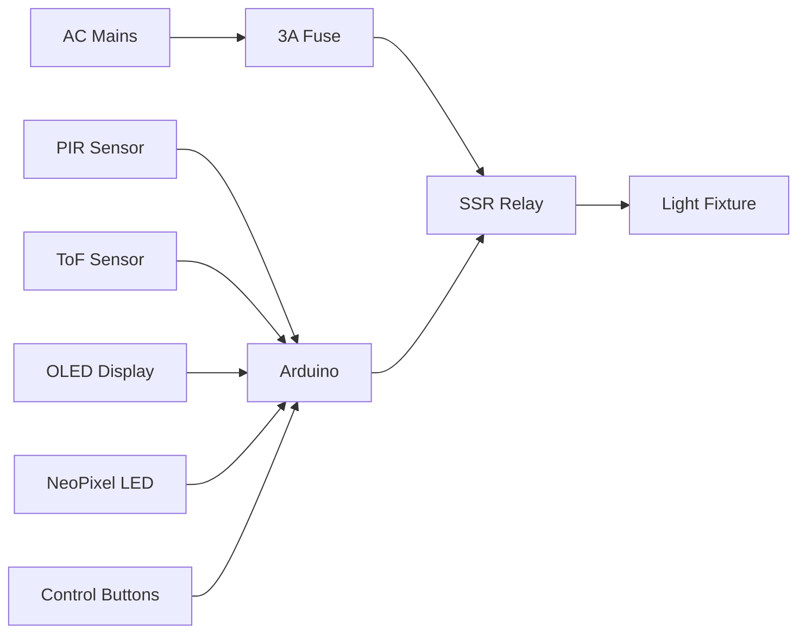

# SmartMotionLight 
**Advanced motion-activated lighting with dual-sensor intelligence and safety-first design**

[](https://opensource.org/licenses/MIT)
[]()
[]()

> Professional-grade automated lighting solution combining precision motion detection with comprehensive safety features


## Features

- **Dual-Sensor Reliability** - PIR motion detection + ToF distance/ambient light sensing
- **Real-Time Monitoring** - OLED display shows system status and sensor readings
- **Safety-First Design** - Solid-state relay with fuse protection and fire-retardant enclosure
- **Auto-Adjusting Lighting** - Daylight harvesting disables lights in bright conditions
- **Manual Control** - Physical buttons for on/override and emergency stop
- **Visual Status** - NeoPixel LED provides intuitive system feedback

## Critical Safety Notice

> **Working with AC mains electricity is extremely dangerous and potentially fatal.**  
> This project involves **LETHAL VOLTAGES** (120V/230V AC). Only proceed if you:
> - Are a qualified electrician
> - Understand electrical safety protocols
> - Use appropriate safety gear (insulated tools, multimeter, etc.)
>
> **[Read full safety guidelines before proceeding](docs/safety_guidelines.md)**

## Hardware Overview

### Core Components
| Component | Specification | Purpose |
|-----------|---------------|---------|
| Arduino Nano | ATmega328P | System controller |
| VL53L0X Sensor | Time-of-Flight | Distance/ambient light measurement |
| HC-SR501 | PIR Motion Sensor | Human movement detection |
| SSR Relay | 5V DC / 240V AC 25A | Safe AC switching |
| OLED Display | 0.96" I2C 128x64 | System monitoring |

**[Complete Bill of Materials](hardware/BOM.md)**

### System Diagram


## Getting Started

### Installation
1. **Clone Repository**
   ```bash
   git clone https://github.com/yourusername/SmartMotionLight.git
   cd SmartMotionLight
   ```

2. **Install Dependencies**
   ```bash
   # PlatformIO
   pio lib install "Adafruit VL53L0X" "Adafruit SSD1306" "Adafruit NeoPixel"
   
   # Arduino IDE
   Install via Library Manager:
   - Adafruit VL53L0X
   - Adafruit SSD1306
   - Adafruit GFX Library
   - Adafruit NeoPixel
   ```

3. **Upload Firmware**
   ```bash
   pio run --target upload  # PlatformIO
   ```
   ```arduino
   // Arduino IDE: Open Smart_Motion_Light_Switch.ino and click Upload
   ```

### Hardware Assembly


1. Mount components in UL94 V-0 rated enclosure
2. Connect sensors to Arduino per wiring diagram
3. Install 3A fuse on AC input line
4. Double-insulate all AC connections

## Usage Instructions

### Basic Operation
1. Power on the system
2. System performs self-test (OLED shows status)
3. Green LED indicates ready state
4. Motion in darkness triggers lighting
5. Lights automatically turn off after 30 seconds

### Control Options
| Button | Function | LED Indicator |
|--------|----------|---------------|
| **ON** | Manual activation | Solid green |
| **OFF** | Emergency stop | Blinking red |
| **Hold OFF 3s** | Calibration mode | Blue pulse |

### Calibration
```bash
1. Enter calibration mode
2. Place reference targets at 50cm, 100cm, 200cm
3. Follow on-screen prompts
4. System stores values in EEPROM
```
**[Detailed Calibration Guide](docs/calibration_guide.md)**

## Customization

### Configuration Options
Edit `config.h` to adjust:
```cpp
// Timing Parameters
#define MOTION_TIMEOUT 30000   // Auto-off delay (ms)
#define DEBOUNCE_MS 50         // Button debounce time

// Sensor Thresholds
#define DISTANCE_THRESHOLD_CM 200  // Max detection range
#define BRIGHTNESS_THRESHOLD 50    // Lux cutoff value

// Safety Parameters
#define SSR_COOLDOWN_MS 500    // Minimum relay off-time
```

### Advanced Features
Uncomment in `config.h` to enable:
```cpp
// #define ENABLE_WIFI         // Add ESP8266 connectivity
// #define ENERGY_MONITORING   // Current sensor integration
// #define BATTERY_BACKUP      // UPS functionality
```

## Contributing

We welcome contributions! Please follow these steps:
1. Fork the repository
2. Create your feature branch (`git checkout -b feature/AmazingFeature`)
3. Commit your changes (`git commit -m 'Add some amazing feature'`)
4. Push to the branch (`git push origin feature/AmazingFeature`)
5. Open a Pull Request

## License
Distributed under the MIT License. See `LICENSE` for more information.

## Acknowledgements
- Inspired by [Light Switch With Motion Detector](https://www.instructables.com/Light-Switch-With-Motion-Detector/)
- Safety guidelines reviewed by certified electricians
- Documentation templates from OpenHW Group
> **Disclaimer**: This project involves working with dangerous voltages. The creators are not liable for any damages or injuries resulting from the use of this design. Always follow local electrical codes and regulations.
