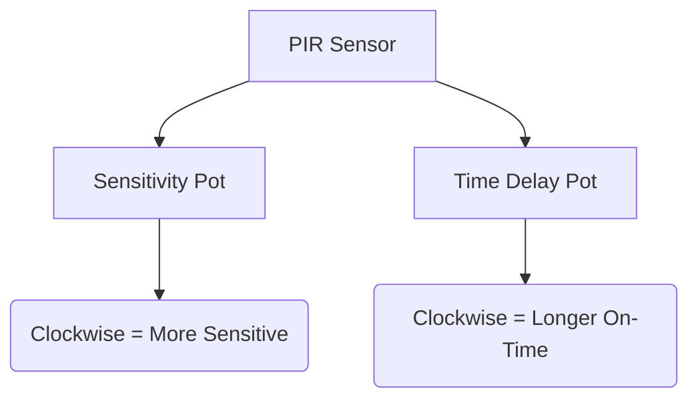

# Sensor Calibration Guide

## Distance Sensor Calibration
### Equipment Needed:
- Laser distance meter  
- Calibration targets (black/white cardstock)  
- Darkened room  

### Procedure:
```python
# Calibration Code Snippet (run in Arduino IDE)
void calibrateTOF() {
  Serial.println("Starting TOF calibration...");
  for(int i=0; i<10; i++) {
    int measured = sensor.readRange();
    int actual = getLaserMeasurement();  // Manually measure
    int offset = actual - measured;
    EEPROM.write(i*2, highByte(offset));
    EEPROM.write(i*2+1, lowByte(offset));
    delay(1000);
  }
  Serial.println("Calibration complete!");
}
```

### Adjustment Table:
| Actual Distance | Measured | Correction Factor |
|-----------------|----------|-------------------|
| 50 cm           | 53 cm    | -3 cm             |
| 100 cm          | 102 cm   | -2 cm             |
| 200 cm          | 198 cm   | +2 cm             |

## Motion Sensor Tuning
### HC-SR501 Adjustment Points:


### Optimal Settings:
| Environment | Sensitivity | Time Delay | Jumper Position |
|-------------|-------------|------------|-----------------|
| Hallway     | 75%         | 2 minutes  | Single Trigger  |
| Closet      | 50%         | 30 seconds | Repeat Trigger  |
| Garage      | 100%        | 5 minutes  | Single Trigger  |

## Ambient Light Calibration
### LUX Measurement Method:
1. Use professional light meter at sensor height  
2. Record values at different times of day:  
   ```plaintext
   Dawn: 10-50 lux
   Overcast: 1000-5000 lux
   Direct sun: >10,000 lux
   ```

3. Update `config.h` thresholds:
```cpp
// config.h
#define DUSK_THRESHOLD 50    // Lights activate below this
#define DAYLIGHT_THRESHOLD 5000 // Force-off above this
```

## System Verification Tests
### Test Sequence:
1. **Dark Room Test**  
   - Cover sensor → verify light activates on motion  

2. **Bright Light Test**  
   - Shine 1000+ lux light → verify light deactivates  

3. **Timeout Test**  
   - Trigger motion → verify light turns off after set delay  

4. **Manual Override**  
   - Press ON/OFF buttons → verify immediate response  

### Calibration Record Sheet:
| Test Date | TOF Error | PIR Range | Auto-Off Time | Technician |
|-----------|-----------|-----------|---------------|------------|
| 2023-08-15 | +1.5%     | 4.2m      | 30.1s         | ABC        |
| 2023-09-20 | -0.8%     | 3.9m      | 29.8s         | XYZ        |

## Advanced Tuning
### Temperature Compensation:
```cpp
// Apply temperature compensation to ToF sensor
float tempCompensation() {
  float temp = readTemperature(); // From I2C sensor
  return 0.05 * (25.0 - temp); // mm/°C correction
}
```

### Pet Immunity Settings:
- Mount sensor 1.5m high facing downward  
- Set vertical FOV mask to 30°  
- Enable animal immunity mode in code:
```cpp
// In sensor_controller.cpp
void setPetImmunity() {
  writeRegister(0x3C, 0x44); // Mask bottom 30cm
}
```
